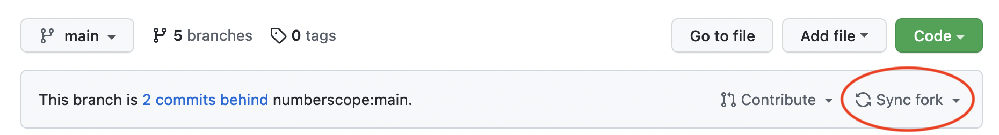

# Contributing to Numberscope

## If you are new to software development and you like videos...

Watch the video series on contributing to Numberscope
[here](https://www.youtube.com/playlist?list=PLA4KIQBQQRb5ccOdr9v0iLw_fKHup1PkU).
This video series will introduce you to Numberscope, GitHub, the software we
use in the Numberscope project, and the workflow for contributing to
Numberscope.

## If you prefer a written guide...

(This assumes you're working on the numberscope/frontscope repository, but it
applies to other repos as well.)

1. [Create a fork of the numberscope/frontscope repo](./doc/working-with-git-and-github.md#create-a-fork).
2. [Clone your fork of numberscope/frontscope](./doc/working-with-git-and-github.md#clone-a-repo).
3. [Create a branch for your contribution](./doc/working-with-git-and-github.md#create-a-branch).
4. [Read about basic Git operations](./doc/working-with-git-and-github.md#basic-git-operations).
5. [Push your branch to GitHub](./doc/working-with-git-and-github.md#push-a-branch).
6. [Read Numberscope's coding principles guide](./doc/code-principles.md).
7. [Read Numberscope's style guide](./doc/code-style.md).
8. [Work through Numberscope's pull request checklist](./doc/pull-request-checklist.md).
9. [Submit a pull request](./doc/working-with-git-and-github.md#submit-a-pull-request).

## If you need help with Git and contributing...

Check out our doc on
[Git scenarios and what to do about them](./doc/git-scenarios-and-what-to-do-about-them.md).

## A note on code organization

The Numberscope system actually comprises two code repositories. This
documentation is generated from the one called `frontscope`
([GitHub](https://github.com/numberscope/frontscope)), and is primarily
concerned with the operation and development of that portion of the system.

The code in this `frontscope` repository is responsible for defining and
displaying the visualizers, and for establishing how to specify the sequences
the visualizers act on. In general, it provides Numberscope's user interface.

If you need to deal with the code responsible for retrieving integer sequences
from the [Online Encyclopedia of Integer Sequences (OEIS)](https://oeis.org/),
or for performing the computations involved in generating sequence entries and
their factorizations, see `backscope`
([GitHub](https://github.com/numberscope/backscope)).

## Submit a pull request

(This assumes you're working on the numberscope/frontscope repository, but it
applies to other repos as well.)

If you've read the
[Numberscope code principles guide](./doc/code-principles.md) and the
[Numberscope code style guide](./doc/code-style.md), and you think your code
is ready to be reviewed by someone at Numberscope, follow these steps:

1. Work through
   [Numberscope's pull request checklist](./doc/pull-request-checklist.md).
2. Sync your fork with the main numberscope/frontscope repository. The easiest
   way to do this is to navigate to the page of your fork of
   numberscope/frontscope and click "Sync fork" (see the picture below).
    Another
   way to do this is to
   [add numberscope/frontscope as a remote](#add-a-remote) and
   [sync your fork with the remote original](#sync-local-fork-with-remote-original).
3. Navigate to the numberscope/frontscope repository. If your fork is synced
   up with the main numberscope/frontscope repository correctly, you should
   see a button (see the image below) that says "Compare & pull request".
   
   Click that button, write up some notes for your pull request, and click the
   "Create pull request button".
