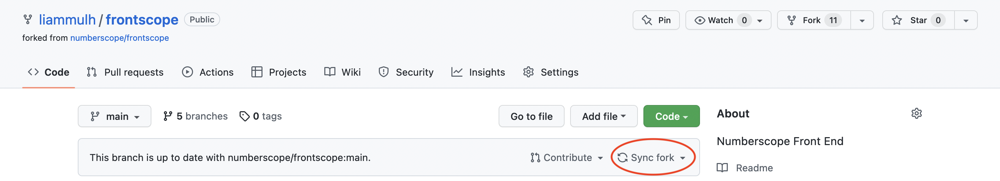

# Contributing to Numberscope

## If you are new to software development and you like videos...

Watch the video series on contributing to Numberscope
[here](https://www.youtube.com/playlist?list=PLA4KIQBQQRb5ccOdr9v0iLw_fKHup1PkU).
This video series will introduce you to Numberscope, GitHub, the software we
use in the Numberscope project, and the workflow for contributing to
Numberscope.

## If you prefer a written guide...

(This assumes you're working on the numberscope/frontscope repository, but it
applies to other repos as well.)

1. [Create a fork of the numberscope/frontscope repo](#create-a-fork).
2. [Clone your fork of numberscope/frontscope](#clone-a-repo).
3. [Create a branch for your contribution](#create-a-branch).
4. [Read about basic Git operations](#basic-git-operations).
5. [Push your branch to GitHub](#push-a-branch).
6. [Read Numberscope's coding principles guide](./doc/code-principles.md).
7. [Read Numberscope's style guide](./doc/code-style.md).
8. [Work through Numberscope's pull request checklist](./doc/pull-request-checklist.md).
9. [Submit a pull request](#submit-a-pull-request).

## If you need help...

Check out our section on
[Scenarios and what to do about them](#scenarios-and-what-to-do-about-them).

<hr>

# Everything from here down is a specific how-to

Follow the numbered guides above.

## Stash your changes

To "stash" your changes (i.e. squirrel them away for later use), issue the
following command:

```sh
git stash
```

## Unstash your changes

To unstash your changes, issue the following command:

```sh
git stash apply
```

The above command keeps the changes in your stash. If you wish to discard
those changes from the stash, issue the following command:

```sh
git stash pop
```

## Create a branch

To create a branch and switch to it in one command, issue the following
command:

```sh
git checkout -b your_branch_name_here
```

At Numberscope we use `snake_case` for branch names.

## Push a branch

To create a branch in a remote Git repository and push your changes to that
branch, issue the following command:

```sh
git push -u name_of_remote name_of_branch
```

The name of the remote is most likely `origin` if you are pushing to a fork of
one of the Numberscope repositories.

## Create a fork

Note: This is a GitHub operation, not a Git operation.

1. Go to the page of the repository you want to clone. For instance, if you
   want to clone the numberscope/frontscope repository, go to
   https://github.com/numberscope/frontscope.
2. In the upper right corner of the page (as of this writing) there should be
   a button that says "Fork". Click that button.
3. Follow the instructions that GitHub provides. Make your GitHub account the
   owner of the fork.

## Clone a repo

To clone a Git repository to your computer, issue the following command:

```sh
git clone https://github.com/some_user_or_org/some_repo.git
```

GitHub allows you to clone the repo a few different ways:

1. via HTTPS (easiest method, doesn't require setup, has limited
   functionality)
2. [via SSH](https://docs.github.com/en/authentication/connecting-to-github-with-ssh/adding-a-new-ssh-key-to-your-github-account)
   (hardest method, requires setup, but ultimately very convenient)
3. [via the GitHub CLI](https://cli.github.com/) (medium difficulty, requires
   some setup)

## Add a remote

To add a remote version of your repository, issue the following command:

```sh
git remote add name_of_remote https://someurl.com/somerepo.git
```

## Basic Git operations

When using Git, it can be helpful to think of it as photographer who stages
your work, takes a snapshot of it, and stores the photo somewhere safe (i.e.
GitHub).

### Add changes

To add or "stage" your work for a commit or "snapshot", issue the following
command:

```sh
git add /path/to/file/here
```

(You should do this command for each file you need to stage.)

### Commit changes

To commit your work or take a "snapshot" of the work, issue the following
command:

```sh
git commit -m "put your commit message here"
```

It's best to write your commit message in the
[imperative](https://en.wikipedia.org/wiki/Imperative_mood) and keep it
shorter than 50 characters.

### Push changes

Before you are able to do this, you either need to install the
[GitHub command line interface (CLI)](https://cli.github.com/) and log in
using the GitHub CLI or
[install an SSH key](https://docs.github.com/en/authentication/connecting-to-github-with-ssh/adding-a-new-ssh-key-to-your-github-account).

To push your changes to a remote version of your repository (i.e. to the
version on GitHub) or to "store" your photo, issue the following command:

```sh
git push
```

## Advanced Git operations

### Sync local fork with remote original

See [this SO answer](https://stackoverflow.com/a/7244456).

First, check to see what your "remotes" (where you'll be pushing to) are:

```sh
$ git remote -v
origin  git@github.com:<org-or-user-name>/<repo-name>.git (fetch)
origin  git@github.com:<org-or-user-name>/<repo-name>.git (push)
upstream        git@github.com:<org-or-user-name>/<repo-name>.git (fetch)
upstream        git@github.com:<org-or-user-name>/<repo-name>.git (push)
```

You should have something like the above. If not, set origin and/or upstream:

```sh
git remote add <remote-name> git@github.com:<org-or-user-name>/<repo-name>.git
```

Get the latest changes for upstream:

```sh
git fetch upstream
```

Go to your main branch:

```sh
git checkout main
```

Rewrite your main branch so that any commits of yours that aren't already in
upstream/main are replayed on top of upstream/main:

```sh
git rebase upstream/main
```

## Submit a pull request

(This assumes you're working on the numberscope/frontscope repository, but it
applies to other repos as well.)

If you've read the
[Numberscope code principles guide](./doc/code-principles.md) and the
[Numberscope code style guide](./doc/code-style.md), and you think your code
is ready to be reviewed by someone at Numberscope, follow these steps:

1. Work through
   [Numberscope's pull request checklist](./doc/pull-request-checklist.md).
2. Sync your fork with the main numberscope/frontscope repository. The easiest
   way to do this is to navigate to the page of your fork of
   numberscope/frontscope and click "Sync fork" (see the picture below).
    Another
   way to do this is to
   [add numberscope/frontscope as a remote](#add-a-remote) and
   [sync your fork with the remote original](#sync-local-fork-with-remote-original).
3. Navigate to the numberscope/frontscope repository. If your fork is synced
   up with the main numberscope/frontscope repository correctly, you should
   see a button that says "Contribute & pull request". Click that button,
   write up some notes for your pull request, and click the "Create pull
   request button".

## Scenarios and what to do about them

Here are the different scenarios you could find yourself in and what to do
about them.

-   1: You have a clone of a Numberscope repository.
    -   1.A: You haven't made changes.
        -   [Create a fork](#create-a-fork).
        -   [Clone your fork](#clone-a-repo).
        -   [Create a branch](#create-a-branch).
        -   [Push a branch](#push-a-branch).
        -   [Read about basic Git operations](#basic-git-operations).
    -   1.B: You have made changes.
        -   1.B.1: You are working on the main branch.
            -   1.B.1.A: You made commits.
                -   Ask someone at Numberscope for help
            -   1.B.1.B: You haven't made commits.
                -   [Stash your changes](#stash-your-changes).
                -   [Create a branch](#create-a-branch).
                -   [Create a fork](#create-a-fork).
                -   [Add the remote of your fork](#add-a-remote).
                -   [Push the branch to your fork](#push-a-branch).
                -   [Clone your fork](#clone-a-repo).
                -   [Read about basic Git operations](#basic-git-operations).
        -   1.B.2: You are working on a different branch.
            -   1.B.2.A: You have made commits.
                -   [Create a fork](#create-a-fork).
                -   [Add the remote of your fork](#add-a-remote).
                -   [Push the branch to your fork](#push-a-branch).
                -   [Clone your fork](#clone-a-repo).
                -   [Read about basic Git operations](#basic-git-operations).
            -   1.B.2.B: You haven't made commits.
                -   [Commit your changes](#commit-changes).
                -   [Create a fork](#create-a-fork).
                -   [Add the remote of your fork](#add-a-remote).
                -   [Push the branch to your fork](#push-a-branch).
                -   [Clone your fork](#clone-a-repo).
                -   [Read about basic Git operations](#basic-git-operations).
-   2: You have a fork of a Numberscope repository.
    -   2.A: You haven't made changes.
        -   [Clone your fork](#clone-a-repo) (if you don't have it on your
            computer yet).
        -   [Create a branch](#create-a-branch).
        -   [Push a branch](#push-a-branch).
        -   [Read about basic Git operations](#basic-git-operations).
    -   2.B: You have made changes.
        -   2.B.1: You are working on the main branch.
            -   2.B.1.A: You made commits.
                -   Ask someone at Numberscope for help.
            -   2.B.1.B: You haven't made commits.
                -   [Stash your changes](#stash-your-changes).
                -   [Create a branch](#create-a-branch).
                -   [Unstash your changes](#unstash-your-changes).
                -   [Push a branch](#push-a-branch).
                -   [Read about basic Git operations](#basic-git-operations).
        -   2.B.2: You are working on a different branch.
            -   2.B.2.A: You have made commits.
                -   [Read about basic Git operations](#basic-git-operations).
            -   2.B.2.B: You haven't made commits.
                -   [Commit your changes](#commit-changes).
                -   [Read about basic Git operations](#basic-git-operations).
