# Building a Visualizer

We'll start with a general outline of creating visualizers, and then provide
some detailed examples and guidance.

## An overview of the process

#### Grab a template for your chosen graphics framework

The easiest way to build a visualizer is to extend a pre-made visualizer base
class, which automatically sets up a graphics framework for you to use. Right
now, there are only two base classes available:

-   [`P5Visualizer`](#a-p5-visualizer-in-detail) uses the
    [**p5.js**](https://p5js.org) library for graphics and user interaction.
-   `P5GLVisualizer`: a slight variant of `P5Visualizer`. You should derive
    from this base class if you wish to use p5.js in WebGL mode. See the
    [Turtle](../src/visualizers/Turtle.md) visualizer for an example.

Note that by "extend a base class," we mean that in the standard TypeScript
sense: You will see that visualizer source code files literally contain a line
like

`class Differences extends P5Visualizer(paramDesc) {`

followed by the code that implements the visualizer class. For a quick start,
copy and modify the template file for your chosen framework, which you can
find in `src/visualizers-workbench`.

If you want to use a new graphics framework, you'll need to write your own
implementation of the
[visualizer interface](../src/visualizers/VisualizerInterface.md).

#### Document as you write

Each visualizer has its documentation woven into the source code, using
special `/** md`&nbsp;…&nbsp;`**/` comments that are automatically compiled
into a [documentation page](../src/visualizers/Differences.md). We have some
[conventions](#how-to-document-your-visualizer) for what the documentation
comments should include and where in the source code they should go.

#### Develop your visualizer on the workbench

While you're working on a visualizer, we recommend keeping it in the
`src/visualizers-workbench` directory, where frontscope typically won't notice
it. To load it, run frontscope in "workbench mode" by calling
`npm run dev:workbench`.

When you're ready to propose your visualizer as an official part of
Numberscope, you'll move it to `src/visualizers`. Then frontscope will notice
and load it when you call the usual `npm run dev`. For details, see
[below](#where-to-put-your-visualizer).

A visualizer, like a work of art, is never really finished—even when it's
accepted into Numberscope. Even the humble template visualizer discussed below
could be extended. You could shorten the infinite progress bar for finite
sequences, allow fast navigation by holding down arrow keys, add a progress
bar mouse-over that shows the index… the possibilities are endless. We invite
you to try extending or enhancing existing visualizers as well as building
your own. For now, though, let's return to the process of making a new
visualizer based on p5.

## A p5 visualizer, in detail

A good way to start a p5 visualizer is to copy and modify the basic example in
the `src/visualizers-workbench` directory:

-   [`P5VisualizerTemplate.ts`](https://github.com/numberscope/frontscope/blob/main/src/visualizers-workbench/P5VisualizerTemplate.ts)

Let's look at the parts of a p5 visualizer. We recommend following along in
the visualizer template as you read, and/or referring to the following
lifecycle diagram of a visualizer. Don't worry if you don't recognize all of
the terms and method names in the diagram at first; the descriptions of the
methods below will help to understand the diagram, and vice versa.

```mermaid

flowchart TB
   Start@{shape: circ, label: " "}
   style Start fill:none,stroke:none
   subgraph NSQNSK [neither sequence nor sketch OK]
   Init@{shape: bow-rect, label: "property<br>initializers/<br>constructor"}
   Start -->|page load/<br>visualizer change| Init
   IPV@{shape: bow-rect, label: "individual parameter<br>validate() functions"}
   Init --> IPV
   end
   style NSQNSK fill:#fee,text-align:left
   subgraph SQBNSK [sequence OK, no sketch]
   CP@{shape: rounded, label: "checkParameters()"}
   IPV --> CP
   Reset@{shape: rounded, label: "reset()"}
   CP -->|initialization/<br>sequence change| Reset
   PC@{shape: rounded, label: "parametersChanged()"}
   CP -->|parameter update| PC
   PC ==> Reset
   PS@{shape: rounded, label: "presketch()"}
   end
   subgraph SQSK [sequence & sketch OK]
   RS@{shape: rounded, label: "resized()"}
   Setup@{shape: rounded, label: "setup()"}
   Reset -->|initialization<br>canvas resize<br>sequence change| PS
   Reset -->|otherwise| Setup
   PS --> Setup
   Draw@{shape: rounded, label: "draw()"}
   Setup --> Draw
   RS ==>|"↑<br>(returns true)<br>↑"| Reset
   RS -->|"↗(returns false)↗"| Draw
   Draw -->|"↑<br>change sequence<br>↑"| CP
   Draw -->|"↑<br>change parameter<br>↑"| IPV
   Draw -->|"[stop()/continue()]"| Draw
   Draw -->|resize window| RS
   end
   style SQSK fill:#efe

```



A few notes on the diagram: Each lavender rounded rectangle represents a
method of the visualizer class that you may override or extend. The rectangles
with curved sides are other parts of the code you may write in your visualizer
implementation. The shaded boxes let you know what context of the
visualization is available for those parts of the code: is it OK to access the
sequence that is being visualized? Is it OK to access the p5 sketch object
that will be drawing the visualization? And finally, the bold arrows represent
default actions that you can override by defining the corresponding methods of
your visualizer.

Now on to the parts of a visualizer implementation:

#### 🔑️ Name _(required)_

Put the visualizer's name in the static `category` property. A brief
description can also be provided. The name and description are used when
presenting visualizers to the user to choose from.

#### 💡️ Parameters _(often used)_

Parameters are the user-facing structures that ask for control values when a
visualizer is created. When someone running your visualizer sets a parameter
in the graphical interface (UI), its value is written to a corresponding
top-level property of the visualizer object. Conversely, if your code
internally changes one of those top-level properties while the visualizer is
running, you should refresh the corresponding parameter by calling
`this.refreshParams()` so the person interacting with it can see the change.

The parameters are described in the `paramDesc` object. A parameter must
specify a `default` value, a `type`, a name (`displayName`), and specify
whether it is `required` (required parameters are displayed more prominently).
You can find a complete list of the options you can set for a parameter on
[this page](../src/shared/Paramable.md).

-   **p5 Template:** `stepSize`.

#### 💡️ Other properties _(often used)_

You may also need internal data (top-level properties that are set and updated
while the visualizer is running, beyond the user's direct control). These
properties might do things like:

-   Keeping track of which part of the sequence you're looking at.
-   Storing colors that are created during setup.
-   Remembering where an animated object is.

By convention, we list these properties after `category` and `description`.

-   **p5 Template:** `index`.

#### 💡️ Determine validity of parameter values _(often used)_

There are three ways the validity of user input is checked. They are listed
here in order of preference.

The first is automatic type checking, based on the `type` property of a
parameter. Type errors are announced by the UI next to the relevant input
field.

The second is storing a function in the `validate` property of a parameter (in
the paramDesc structure); such checks concern only that single parameter. For
example, a parameter typed as an integer may run a validation to check that
the integer entered is positive. Any errors or warning messages from such
checks will immediately be displayed to the user next to the relevant
parameter entry field.

The third is an opportunity to check global consistency among many parameters.
For example, it may be that the number of items in two separate list
parameters must be equal. Such checks can be performed in the function
`checkParameters()`, which is called whenever parameters are changed by the
user, giving you a chance to check the parameter values and prompt the user to
correct any invalid ones. In this function, you can provide errors or warning
messages to be displayed at the top of the parameters panel by placing them in
the returned status object. You may also or instead put errors or warnings
next to a specific parameter: suppose the parameter is named `speed`. Then you
can write `this.statusOf.speed.addWarning(message)`, for example. Note that if
you add an error to any specific parameter, you should also make sure that
checkParameters returns an invalid status.

By the time checkParameters() is called, the visualizer's sequence should be
sufficiently initialized that you can depend on its `first` and `last` (index)
values, in case you need those for validation. (And hence, checkParameters()
will be called again if the sequence changes.) On the other hand, the sketch
will not necessarily yet be available. You can do sketch-dependent validation
in [`setup()`](#set-up-the-visualizer-often-used), as described below. At that
point, errors you add to the parameters or the visualizer's `validationStatus`
won't block the new parameters from taking effect as they would if handled in
checkParameters(), but at least the person running the visualization will be
notified.

Finally, note that checkParameters is called with _tentative_ parameter values
and there is no guarantee that those parameter values will actually be loaded
into the visualizer. So (a) only access the values through the passed-in
`params` object, not through the visualizer itself, and (b) don't start
setting up for visualization using those values: leave that to one of the
set-up functions discussed [below](#set-up-the-visualizer-often-used).

-   **p5 Template:** Make sure that the step size is positive.

#### 🔩️ Inhabit a page element _(advanced)_

Each time the visualizer is inserted into a page element, the `inhabit()`
function is called, giving you access to the element the visualizer is about
to inhabit. If you don't need information from the web page your visualizer is
running in, or access to its document object model (DOM), you shouldn't need
to implement `inhabit()`. The full details on this method are in the
[visualizer interface](../src/visualizers/VisualizerInterface.md)
documentation.

#### 💡️ Handle aspect ratio _(often used)_

By default, a visualizer does not set its own sketch dimensions (width and
height). Instead, the Numberscope UI assigns these dimensions, providing the
visualizer with the largest available canvas for the user's setup.  
After `setup()` is run, the dimensions are stored in `this.sketch.width` and
`this.sketch.height` and the visualizer should handle all its drawing with
respect to these.

In some cases, a visualizer design may run best in a fixed aspect ratio, such
as a square canvas. In this case, you can request a specific aspect ratio by
implementing `requestedAspectRatio()` to return the ratio as a number
representing width/height. In this case, the UI will provide a canvas of the
maximal size with that ratio.

#### 💡️ Set up the visualizer _(often used)_

There are two places to do pre-computation before the sketch begins looping
through frames of the drawing. The first is `presketch()`, which runs
asynchronously, meaning that the browser will not be blocked while this
function completes. This facility is not a part of p5.js, but a part of
Numberscope. The `presketch()` function is called by the framework with one
argument, representing the size of the canvas to be created as a ViewSize
object with number fields `width` and `height`.

If you implement `presketch()`, begin by calling
`await super.presketch(size)`, which will initialize the sequence. After this
call, you have access to the values of the sequence, so you can do
sequence-dependent initialization here. It is OK to set up private state
variables in this method. For example, this is a good place to populate an
array with time-consuming precomputed values you will use repeatedly during
the sketch. However, you still have no access to the p5 canvas or the
`this.sketch` object.

Note also that `presketch()` is called when there is a new visualizer, when
the sequence changes, when the canvas size changes, and when you reload the
page or visit a new Numberscope URL. It is not called when visualizer
parameters change. So if there is initialization you want to do only on these
more signifcant changes but not on parameter changes, then `presketch()` is a
good method.

The next opportunity to do initialization/precomputations is when the p5
graphics context becomes available, which occurs after `presketch()`
completes. At this time, `setup()` is called, giving you your first chance to
set graphics options and draw on the canvas. For example, p5 colors cannot be
dealt with in `presketch()`, but can be set up here. This is a good place for
one-time graphics operations, like painting the background of a static
visualizer or setting colors and stroke options that won't change from frame
to frame.

If you implement `setup()`, start by calling `super.setup()`, which includes
the [`createCanvas()`](https://p5js.org/reference/#/p5/createCanvas) call that
must appear in every p5 setup function.

When a visualizer is resized, or the restart button on Numberscope is pressed,
the class function `reset()` is called. By default, this calls `setup()`, and
a new canvas is created. In this event, `presketch()` will only be called if
that new canvas is a different size than the previous one. However, the
visualizer object constructor is not re-run and any data stored in variables
in the visualizer object persists. Those defaults mean that you have the
option to forgo re-doing expensive pre-computations: if they don't need sketch
access, you can put such calculations in `presketch()`. But the flip side is
that you can't rely on property initializers, your class constructor, or on
(say) checkParameters() to put your other visualizer instance properties in a
"clean" state. For example, if you need some array to be all zeros when you
start drawing your visualization, and previous calls to `draw()` may have
changed some of those array entries, you need to zero it out in `setup()`
because after a parameter change, that's the only preparation function that
will by default be called before going back into the drawing loop.

For even greater customization of what happens when, you can override/extend
`reset()` from the `P5Visualizer` base class, or you can define a `resized()`
method for behavior that only occurs when the canvas is resized. Note that in
this latter case, you can control whether the framework does the `reset()` for
you: return `true` if you have handled any need to reset (and so the framework
should NOT call `reset`), and false if you do want the framework to `reset()`.

-   **p5 Template:** Go to the beginning of the sequence. Create palette
    colors. Set text alignment.

#### 🔩️ Show or stop the visualization; depart from a page element _(advanced)_

You shouldn't frequently need to implement `show()`, `stop()`, or `depart()`.
You can learn about them from the
[visualizer interface](../src/visualizers/VisualizerInterface.md)
documentation, and from how they're implemented in the `P5Visualizer` base
class.

#### 🔑️ Draw the visualization _(required)_

The `draw()` function is called on each frame, giving you a chance to draw
your visualization! Look at the examples and the p5
[tutorials](https://p5js.org/learn/) and
[p5.js reference](https://p5js.org/reference/) to learn about what you can do.

Drawing tools and options are found in the graphics context, `this.sketch`.
Accessing `this.sketch` triggers some consistency checks, so we recommend
storing its value as a local constant in each function call that uses it. This
avoids redundant checks.

Sequence information is found in `this.seq`. This is a `SequenceInterface`
object, so it will always have a method `getElement(n)` that returns the `n`th
entry in the sequence.

You have to implement the `draw()` method, even if it does nothing. Your
visualizer can't be loaded into Numberscope without it.

#### 💡️ Stop and start animation _(often used)_

If your visualization is a static picture, call the visualizer `stop()` method
when you're done drawing. This stops the p5 animation loop, so you don't waste
time re-drawing the same picture dozens of times per second. If the
visualization is only static temporarily, you can call `continue()` to
re-start the animation loop whenever you need to.

If you have previous experience with p5.js, you might be used to calling
`noLoop()` and `loop()` to stop and start your sketch. In a visualizer,
however, you need to use its `stop()` and `continue()` methods to ensure that
all of Numberscope's controls remain properly updated.

As an advanced option, `stop()` can also take a maximum number of additional
frames to draw. So if you you only want your visualization to run for 100
frames, you could just call `this.stop(100)` right in your `setup()` function.

-   **p5 Template:** Stop the animation loop at the end of each frame. Only
    start it again when the user steps to a different sequence entry,
    requiring the picture to be re-drawn.

#### 💡️ Respond to user interactions _(often used)_

Each time the user interacts with your visualization, an
[event handling](https://p5js.org/reference/#group-Events) function like
`keyPressed()` or `mouseClicked()` will be called, giving you a chance to
respond. There are handlers for a wide variety of input events.

#### 🔑️ How to make your visualizer available _(required)_

The engine expects the visualizer to be packaged in a `VisualizerExportModule`
object, constructed from the visualizer class and a short description string.
This "export" happens after the class definition.

#### 🔩️ How to handle errors _(advanced)_

There are two ways to let people interacting with a visualizer know that
something unexpected has happened. The first is with the
[alertMessage](../src/shared/alertMessage.md) utility. The second is to just
throw an error. If it's not caught anywhere else, the visualizer framework
will show it in an error dialog.

#### 🔩️ Getting random numbers _(advanced)_

Do not use the built-in `Math.random()` random number generator, because there
is no practical mechanism for making its output reproducible for testing
purposes. Instead, obtain random numbers using the provided `math` module,
along the following lines:

```
import {math} from '@/shared/math'
import {P5Visualizer} from '@/visualizers/P5Visualizer'

class DiceVisualizer extends P5Visualizer({}) {
    ...
    draw() {
        ...
        // Roll a die (generate a number 1, 2, 3, 4, 5, or 6,
        // all equally likely, at random):
        const myRoll = math.randomInt(1, 7)  // upper limit is exclusive.
        ...
```

For more details, see the [math documentation](../src/shared/math.md).

### How to document your visualizer

Documentation should be included in the source file between markdown tags
`/** md` and `**/`. This will be scraped from the source and automatically
compiled into the online documentation. The p5 Template visualizer
demonstrates our documentation conventions. That template also includes other
helpful comments marked with `// ===`; these are not compiled into the online
documentation and are only provided in the template to augment this guide (you
need not imitate this).  
You should also provide any additional code documentation in place as you
normally would.

#### Name, sample image, and description

In a documentation block just before the visualizer class definition, put a
level-1 heading with the visualizer's name, followed by a sample image and a
description.

To make the sample image, take a screenshot of your visualizer and put it in
the `src/assets/img<VisualizerName>` directory. Add the image to the
documentation page as shown in the examples, using the `width` property for
scaling.

Below the sample image, describe what the visualizer does. Please be precise
about exactly how the image is created from the terms of the sequence.

#### Parameters

In a documentation block just before definition of `params`, put "Parameters"
in a level-2 heading. Inside the definition of `params`, just before each the
parameter's key, put a documentation block that displays like this:

> **Parameter name:** Description of the parameter. _(Type and constraints.)_

#### Controls

If users can interact with your visualizer while it's running, these
interactions should be documented too. In a documentation block just before
the first event handling method, put "Controls" in a level-2 heading. Display
control information like this:

> **Key or gesture:** Description of effect.

You can organize the control documentation comments in whatever way makes the
most sense. If possible, order the event handling methods so that most
controls can be documented near the method that implements them.

#### Additional documentation

Any additional documentation should go in documentation comments after all of
the event handling methods. This is the place for in-depth discussions,
example settings, image galleries, credits, and so forth.

Code-related documentation, like explanations of algorithms used in the
visualizer, should go as close as possible to the related code. This means, in
particular, that code requiring additional documentation should come after the
event handling methods if possible.

#### Export block

The `VisualizerExportModule` block should be the last thing in the visualizer
source file. That makes it easy to find.

## Where to put your visualizer

However you made it, when a visualizer is ready for other Numberscope users,
place the file containing its class definition and export module in the folder
`src/visualizers`. When the frontscope client runs, it'll find your visualizer
and compile it at runtime.

If running `npm run dev`, visualizers in `src/visualizers` will be available.
As discussed [earlier](#develop-your-visualizer-on-the-workbench), visualizers
that aren't ready for Numberscope users should go in
`src/visualizers-workbench`. You can load them (and the P5Template visualizer
discussed in this guide) to see how they work by running with
`npm run dev:workbench`.
